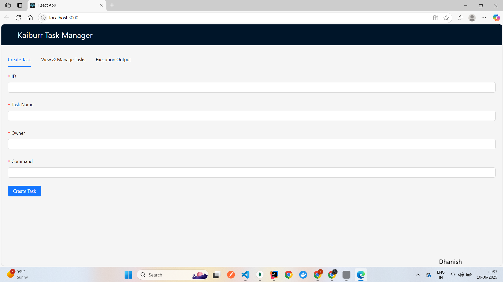
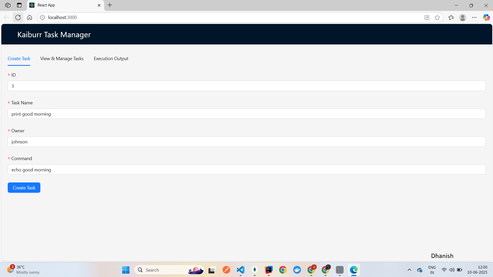
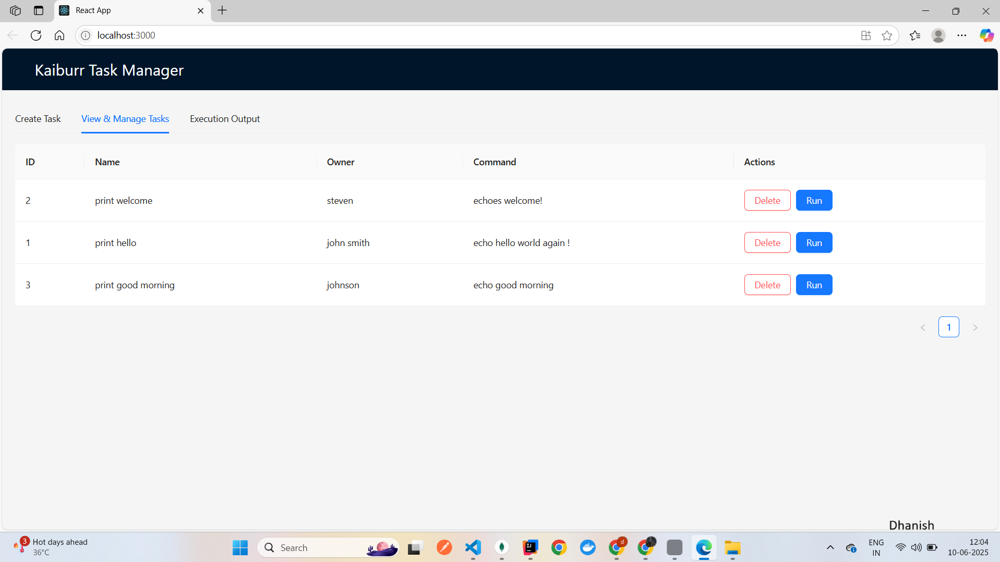
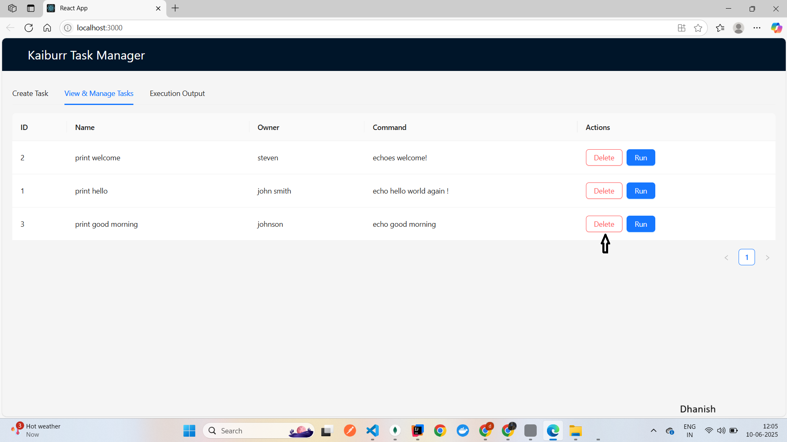
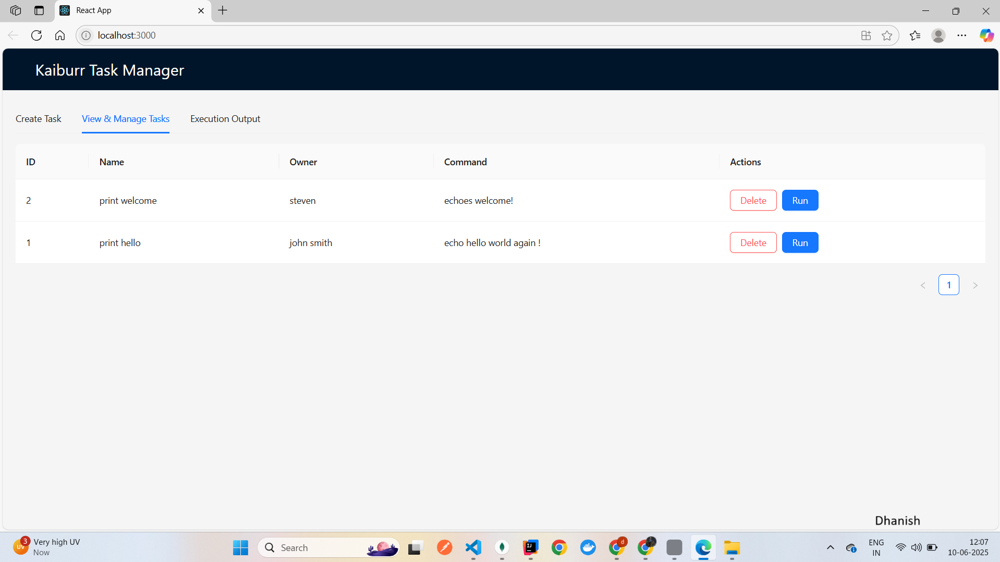
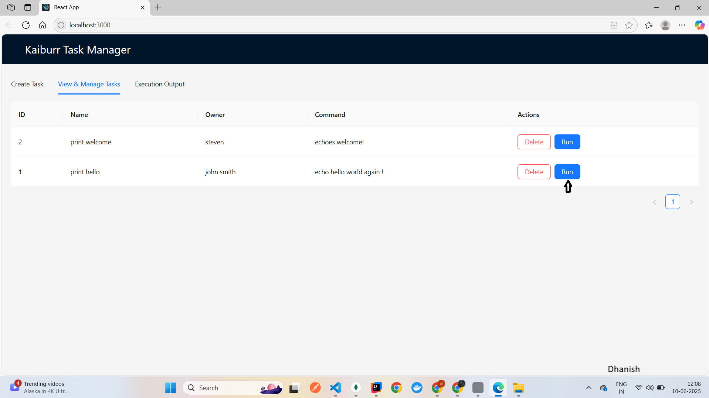
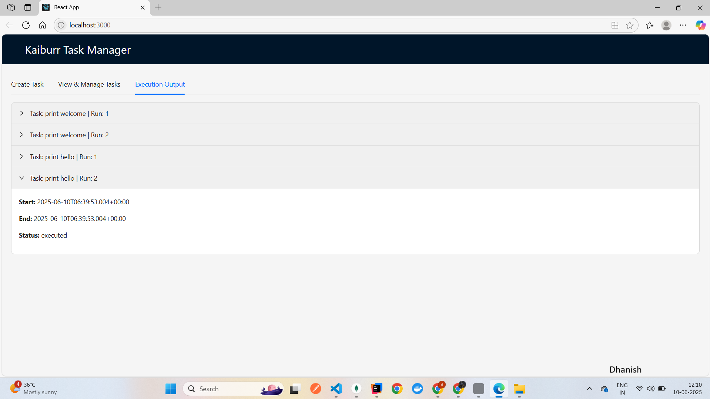

# Kaiburr Task 3 - React Frontend UI

This repository contains my implementation of **Task 3** for Kaiburr’s assessment — a React-based frontend UI for interacting with the backend REST API.

---

## 📁 Project Overview

- **Frontend**: React.js (Vite/CRA)
- **Features**:
  - Fetch and display tasks from the backend
  - Create new tasks
  - Delete tasks
  - Execute tasks (run commands in Kubernetes pods)

---

## 🚀 Running the Application

1. Install dependencies:

    ```bash
    npm install
    ```

2. Start the development server:

    ```bash
    npm start
    ```

3. Access the app in your browser:

    ```
    http://localhost:3000
    ```

---

## 📸 Screenshots

✅ The following screenshots include the **date/time and my name** to verify authenticity.

### 🌐 Home Page
This is the **home page** showing all tasks fetched from the backend:



---

### 📝 Creating a Task

✅ **Before pressing the “Create” button:**  


✅ **After pressing the “Create” button and task created:**  


---

### 🗑️ Deleting a Task

✅ **Before pressing the “Delete” button:**  


✅ **After pressing the “Delete” button and task deleted:**  


---

### ⚡ Executing a Task

✅ **Before pressing the “Run” button:**  


✅ **After pressing the “Run” button and seeing the result:**  


---

## 📦 Deployment Notes

✅ The frontend interacts with the backend REST API (deployed in Kubernetes as part of Task 2).

---

✅ **Task 3 complete!**  
**Author**: Dhanish  
**Date**: 2025
